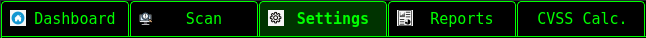

# ReconCraft v3.0 - Craft Your Edge


[](https://www.python.org/)  []() []() []()
[](https://pypi.org/project/PyQt5/)                 							[](https://www.linkedin.com/in/nirmalchak/)    [](CONTRIBUTING.md) [](LICENSE)  


[📦Installation](#installation) •[📸Screenshots](#screenshots) •[🛠️Workflow](#quick-workflow) •[🔌Plugin System](#plugin-system) •[🏗️Organised Scan Output](#organized-scan-output)


## 🚀Overview

**ReconCraft** is a modular reconnaissance & vulnerability scanning framework with a modern PyQt5 GUI.  
It is designed for penetration testers, bug bounty hunters, and security professionals who want efficiency, accuracy, and extensibility.

## ✨Features

⚡ **Linux Supremacy**- Battle Tested on Linux 🐧<br>
🔌 **Dynamic plugins** – Add or remove tools in `/plugins`  reflected in UI.<br>
 🚀 **Parallel scanning** Across multiple tools & targets.<br>
 🎛 **Forge Your Profiles** – Create your own Aggressive, Normal, Passive and Custom mode.  
📊 **Dashboard & Reports** – Instant scan summaries, browsable results.<br> 
 🧮 **CVSS Calculator** – v3.1 Interactive scoring (v4.0 coming soon)  
 🛡 **Tool health checks** – One-click verification  
 📥 **Auto-installer** – apt, pip, go, git, Docker supported.<br> 
 🛑 **Abort anytime** – Co-operative cancel for scans & installs  
 🔑 **Sudo awareness** – Smart prompts & UI alerts (no frozen windows)  
 🌐 **Auto-assist** – If installs fail, opens manual docs or support tab in browser.<br> 
 📜 **Real-time output** – Status updates, logs, and progress bars.  
 🧹 **Resource control** – Tweak concurrency at your will for stable/hyper performance.  
 🎨 **Modern PyQt5 UI** – Themes, icons, responsive design  
 🆓 **Open source** – MIT licensed

  
## ⚙️**Core Blueprint**

```plaintext
ReconCraft/  

├── main.py # Entry point for GUI  
├── install.py # Installer script  
├── core/ # Core engine (controller, scan thread, installer utils, file conventions, cvss_calc)  
├── gui/ # PyQt5 GUI (tabs: Scan, Reports, Settings, Dashboard, CVSS Calc.)  
├── plugins/ # Drop-in tool plugins (nmap, amass, nuclei, etc.)  
├── assets/ # Icons, logos, screenshots  
├── requirements.txt # Python dependencies  
└── README.md 
```
  

## 🖥️GUI Tabs


- **Dashboard (Home)** – Summary of completed scans with status indicators. 
- **Scan** – Select plugins, configure arguments, start/abort scans. 
- **Settings** – Choose scan profiles (`Aggressive`, `Normal`, `Passive`, `Custom`).
- **Reports** – Browse & view reports directly within the UI.   
- **CVSS Calc.** – Interactive CVSS 3.1 base score calculator.


## 🔌Plugin System

Plugins are **self-contained Python files** under `/plugins`.  
> **❗ They handle Install Missing tools and all Scan Profiles.❗**

```python
# Required
REQUIRED_TOOL = "toolname"	# Used for installation
INSTALL_HINT  = "apt"   	# one of: apt | brew | choco | pip | go | git | manual | docker

# Optional
INSTALL_URL   = "" 		# Docs/repo page (shown to user for manual/git)
EXECUTABLE    = ""		# How ReconCraft should call it; default = REQUIRED_TOOL
TOOL_ALIAS    = ""		# shim/alias (used esp. for Docker); default = EXECUTABLE or REQUIRED_TOOL
DOCKER_RUN    = ""  	# only if INSTALL_HINT == "docker"

# Default arguments for different scan profiles 
DEFAULT_ARGS  = {
"Aggressive": "-arg1 -arg2 -extra-aggressive {{target}}",
"Normal": "-arg1 -arg2 {{target}}",
"Passive": "DISABLED", 		# set to DISABLED to skip in Passive mode
"Custom": "{{target}}", 	# GUI replaces with user input when profile=Custom
}

def build_command_args(target, custom_args=None): ...
def get_install_info(): ...
def validate(): ...
def run(): ...
```
  Current plugins include: `nmap`, `amass`, `naabu`, `nuclei`, `testssl`, `subfinder`, `rustscan`, `wafw00f`, `gobuster`, and more.


## 🏗**Organized Scan Output**

~~~bash
Scan Results/
└─ multi_2025-08-25_03-22-40
   ├─ All Reports
   │  ├─ domain.com					# First Target (Domain/IP)
   │  │  ├─ nmap					# First Tool
   │  │  │  └─ 20250825_032240
   │  │  │     ├─ raw_nmap.log
   │  │  │     ├─ formatted/		#In Upcoming Updates
   │  │  │     └─ exports/
   │  │  └─ sslscan 				# Second Tool 
   │  │     └─ 20250825_032241
   │  │        ├─ raw_sslscan.log
   │  │        ├─ formatted/
   │  │        └─ exports/
   │  ├─ tesla_com                  # Second Target (Domain/IP)
   │  │  ├─ nmap/   └─ 20250825_032258/ (raw_nmap.log …)
   │  │  └─ sslscan └─ 20250825_032259/ (raw_sslscan.log …)
   │  └─ 127.0.0.1					# Third Target (Domain/IP)
   │     └─ nmap    └─ 20250825_032340/ (raw_nmap.log …)
   └─ machine          			 	 #Future purpose not for current funtioning 
~~~

## 📦Installation

### Clone Repo + Install + Run

```bash
git clone https://github.com/sneakywarwolf/ReconCraft.git
cd ReconCraft
python install.py		#Automatically creates python venv and install requirements
sudo python main.py 
```
> ⚠️ Use sudo since some tools require sudo rights.
> Use “Check Tools” or “Install Missing Tools” for help

## 🛠**Quick Workflow**

1.  **Launch ReconCraft**
    -   Run with SUDO for optimal functionality.
2.  **Check Tools**
    -   One-click check for installed/missing tools.
    -   Auto-install missing tools (via apt, pip, go, git, Docker) or provide manual assistance.
3.  **Configure Scan**
    -   Input targets: Strictly **IP/ Domain** Only
    -   Select plugins: nmap, nuclei, amass, gobuster, etc.
    -   Choose profile via settings: Aggressive, Normal, Passive, or Custom.
4.  **Start Scan**
    -   Real-time output with logs and progress bars.
    -   Option to safely abort scans anytime.
5.  **Monitor Scans**
    -   View progress via the Output screen and elapsed timer.
    -   Access scan summaries in the Dashboard.
    -   Open results directly from the Reports tab.
6.  **Score Impact**
    -   Use the CVSS Calculator (v3.1 supported, v4.0 planned) for manual severity assessment.


## 📸Screenshots

| &emsp;&emsp;&emsp;&emsp;&emsp;&emsp;&emsp;&emsp;&emsp;&emsp; Scan Tab &emsp;&emsp;&emsp;&emsp;&emsp;&emsp;&emsp;&emsp;&emsp; | &emsp;&emsp;&emsp;&emsp;&emsp;&emsp;Check Tools with Dynamic Status&emsp;&emsp;&emsp;&emsp;|
| ---------------------------------------------------------- |  ---------------------------------------------------------- |
 |  

| &emsp;&emsp;&emsp;&emsp;&emsp;&emsp;&emsp;&emsp;&emsp;&emsp;CVSS-Calc&emsp;&emsp;&emsp;&emsp;&emsp;&emsp;&emsp;&emsp;&emsp; |&emsp;&emsp;&emsp;&emsp;&emsp;&emsp; Some Tools Missing &emsp;&emsp;&emsp;&emsp; |
| ---------------------------------------------------------- |  ---------------------------------------------------------- |
|  |  |

|&emsp;&emsp;&emsp;&emsp;&emsp;&emsp;&emsp;&emsp;&emsp;&emsp;Scan Running&emsp;&emsp;&emsp;&emsp;&emsp;&emsp;&emsp;&emsp;&emsp;|&emsp;&emsp;&emsp;&emsp;&emsp;&emsp; Scan Profiles &emsp;&emsp;&emsp;&emsp;|
| ---------------------------------------------------------- |  ---------------------------------------------------------- |
|  |  |

|&emsp;&emsp;&emsp;&emsp;&emsp;&emsp;&emsp;&emsp;&emsp;&emsp;Report Viewing&emsp;&emsp;&emsp;&emsp;&emsp;&emsp;&emsp;&emsp;&nbsp;  |&emsp;&emsp;&emsp;&emsp;&emsp;&emsp; Themese to Switch &emsp;&emsp;&emsp;&emsp;|
| ---------------------------------------------------------- |  ---------------------------------------------------------- |
|  | |


## 🚧Upcoming Features

* Integrating AI Agents (Kindly contribute ;)
* Dynamic/Impressive Dashboard to List critical items
* Automatic Updates
* Extracting CVEs for More dynamic Reporting
* Multiple Workflows
* Modular Chaining
  
 ## Legal & Ethical Use


✅ **Permitted Use Cases**
**Authorized Pentests** – Only with written consent from the system owner
**Bug Bounty Engagements** – Stay strictly within program rules & defined scope
**CTFs & Labs** – Safe, educational, and competitive practice grounds
**Personal/Owned Systems** – Research on infrastructure you control or are cleared to test
**Red Team Missions** – Conducted under explicit organizational approval
    

❌ **Prohibited Activities**
**Unapproved Testing** – Never probe systems without explicit permission
**Illegal / Malicious Actions** – No exploitation for harm or personal gain
**Data Exfiltration** – Accessing or stealing information you’re not authorized to handle

## 🤝Contributing

Contributions, issues, and PRs are welcome!

See [CONTRIBUTING.md](CONTRIBUTING.md) for details.


## 🛡️License & Credits

ReconCraft is released under the MIT License.

**You must retain credit to the original author ("Nirmal Chakraborty") in all copies or substantial portions, and in any derivative works.**

If you use, extend, or share ReconCraft or any part of it, please provide visible attribution and a link to the original project.


## 📬Contact

*  **GitHub:** [sneakywarwolf](https://github.com/sneakywarwolf)
*  **LinkedIn:** [Nirmal Chakraborty](https://www.linkedin.com/in/nirmalchak/)
*  **Email:** [sneakypentester@gmail.com](mailto:sneakypentester@gmail.com)

---
**Craft your recon. Craft your edge. — ReconCraft**