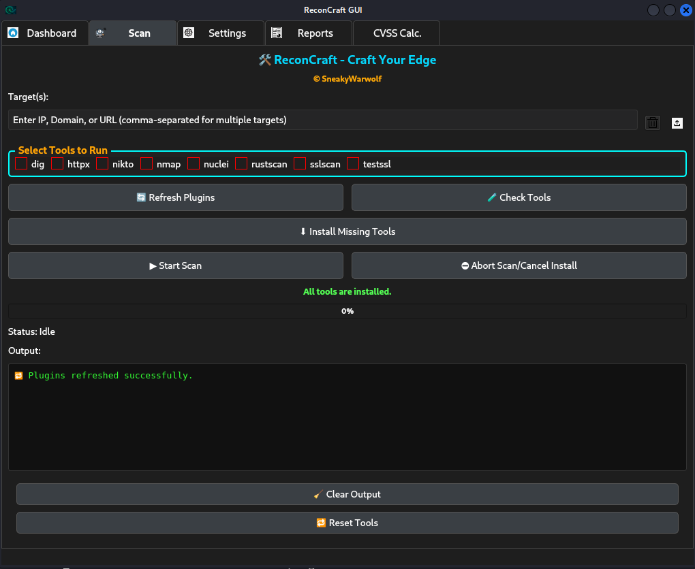

# ReconCraft


[](https://www.python.org/)
[](https://pypi.org/project/PyQt5/)
[](LICENSE)
[](https://github.com/sneakywarwolf/ReconCraft/stargazers)
[](https://www.linkedin.com/in/nirmalchak/)

---

## 🚀 Overview

**ReconCraft** is a powerful, extensible reconnaissance automation toolkit for penetration testers, bug bounty hunters, and security professionals.

- **Dynamic plugin loading**: Add or remove recon tools as Python plugins—no code changes needed.
- **Parallel scanning**: Scan multiple targets with multiple tools, all at once.
- **Tool health checks**: Instantly see which tools are installed or missing.
- **Automatic installer**: Attempt to auto-install missing tools (via apt, brew, pip, etc.).
- **Modern UI**: Fast, dark-mode PyQt GUI.

> **Upcoming:** Custom tool arguments per plugin (configure flags, wordlists, and options from the Settings tab).

---

## 📁 File Structure

```plaintext
ReconCraft/
│
├── .git/                # Git repo metadata
├── __pycache__/         # Python cache files
├── assets/              # App icons, banners, UI images
├── core/                # Core logic (e.g., scan threading)
├── gui/                 # PyQt5 GUI code
├── plugins/             # Python recon plugins (nmap, amass, etc.)
├── Scan Results/        # Output directory for all scans
├── install              # Install helper script (if present)
├── main                 # Main entrypoint script
├── README.md            # Project README (this file)
└── requirements         # Python requirements.txt
```

---

## 📸 Screenshots

| Scan Tab                                  | Check Tools / Status |
|--------------------------------------------|-----------------------|
|     |  |

---

## 🛠️ Features

- **Plugin Architecture**  
  Add new tools by dropping plugins into `/plugins`. Plugins define their binary, install method, and options.
- **One-Click Parallel Scanning**  
  Select multiple tools and targets, launch in parallel, view logs and status in real time.
- **Check Tools & Auto-Install**  
  “Check Tools” reports missing/installed tools. “Install Missing Tools” tries to install any missing dependencies.
- **Abort & Progress**  
  Track status, abort scans, and get notified if any tool fails.
- **Modern UI**  
  Dark mode, intuitive layout, tabbed navigation.

---

## ⚡ Getting Started

### **Requirements**
- Python 3.8+
- [PyQt5](https://pypi.org/project/PyQt5/)
- Common recon tools (nmap, amass, gobuster, nuclei, subfinder, etc.)  
  *(auto-install via “Install Missing Tools”)*

### **Install**

```bash
git clone https://github.com/sneakywarwolf/ReconCraft.git
cd ReconCraft
pip install -r requirements.txt
python main.py
```

> ⚠️ Some recon tools need system dependencies or root/admin rights.  
> Use “Check Tools” or “Install Missing Tools” to help set up.

---

## 🧩 Plugin System

- Drop `.py` plugin files in `/plugins` (e.g., `nmap.py`, `amass.py`).
- Each plugin specifies:
    - `REQUIRED_TOOL` (the binary/script name)
    - `INSTALL_HINT` (e.g., `apt`, `pip`, `go`, or `manual`)
    - (Optionally) `INSTALL_URL`
    - Main `run()` method.
- Plugins appear as tools in the Scan tab with checkboxes.

---

## 🧑‍💻 Plugin Development Guide

You can write your own plugin for ReconCraft in just a few lines!

### **Basic Plugin Template**

Create a new file (e.g., `plugins/mytool.py`):

```python
REQUIRED_TOOL = "nmap"  # The system binary or script name
INSTALL_HINT = "apt"    # One of: apt, brew, choco, pip, go, manual
INSTALL_URL = "https://nmap.org/download.html"  # Optional, for manual

def run(target, args=None):
    import subprocess
    cmd = ["nmap"]
    if args:
        cmd.extend(args.split())
    cmd.append(target)
    result = subprocess.run(cmd, capture_output=True, text=True)
    return result.stdout if result.returncode == 0 else result.stderr
```

- `REQUIRED_TOOL`: Name used by `shutil.which()` to check if installed.
- `INSTALL_HINT`: Used by auto-installer (apt/brew/pip/go/manual).
- `INSTALL_URL`: (Optional) Opened if auto-install is not possible.
- `run(target, args)`: Core logic. Returns output as string.

**Pro tip:** You can expose more arguments and options for advanced plugins!

---

### **Example: Gobuster Plugin**

```python
REQUIRED_TOOL = "gobuster"
INSTALL_HINT = "apt"
INSTALL_URL = "https://github.com/OJ/gobuster"

def run(target, args=None):
    import subprocess
    wordlist = "/usr/share/wordlists/dirb/common.txt"
    cmd = ["gobuster", "dir", "-u", target, "-w", wordlist]
    if args:
        cmd.extend(args.split())
    result = subprocess.run(cmd, capture_output=True, text=True)
    return result.stdout if result.returncode == 0 else result.stderr
```

---

## ⚙️ Tool Status & Installation

- **Check Tools**  
  Shows which tools are installed and which are missing.
- **Install Missing Tools**  
  Tries to install via your package manager or pip, or opens install page if not possible.

---

## 🚧 Upcoming Features

- **Custom Tool Arguments (per plugin/tool)**
- Scan profile presets
- Advanced HTML/PDF reporting
- More plugins (community contributions welcome!)
- Cloud integrations (S3, GDrive, etc.)
- Headless/CLI automation

---

## 🤝 Contributing

Contributions, issues, and PRs are welcome!  
See [CONTRIBUTING.md](CONTRIBUTING.md) for details.

---

## 🛡️ Disclaimer

ReconCraft is for **authorized security testing and educational use only.**  
The author is not responsible for misuse.

---

## 📬 Contact

- **GitHub:** [sneakywarwolf](https://github.com/sneakywarwolf)
- **LinkedIn:** [Nirmal Chakraborty](https://www.linkedin.com/in/nirmalchak/)
- **Email:** [Gmail](sneakypentester@gmail.com)

---

**Craft your recon. Craft your edge. — ReconCraft**
