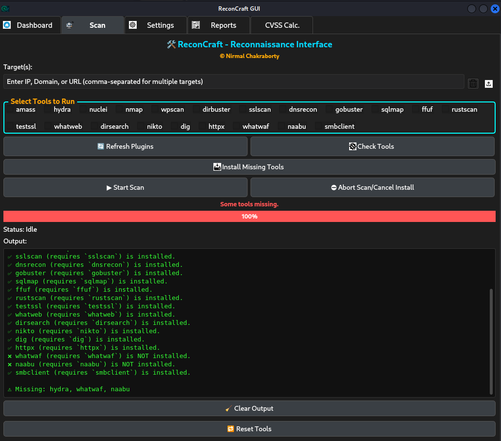

# ReconCraft

  

  


  

  

[](https://www.python.org/) [](https://pypi.org/project/PyQt5/) [](LICENSE) [](https://github.com/sneakywarwolf/ReconCraft/stargazers) [](https://www.linkedin.com/in/nirmalchak/)

  

  

---


## 🚀 Overview

  

**ReconCraft** is a modern, extensible reconnaissance automation toolkit for penetration testers, bug bounty hunters, and security professionals.

  

-  **Dynamic plugin system** – Just drop plugins in `/plugins` to add/remove tools.


-  **Parallel scanning** – Scan multiple targets and tools, all at once.


-  **Scan profiles & arguments** – Aggressive, Normal, Passive, or Custom mode per tool.

  
-  **Resource management** – Limit concurrency for VM stability.


-  **Tool health checks** – Instantly see which tools are installed or missing.

  
-  **Automatic installer** – Try to install missing tools (apt, brew, pip, go, etc.).


-  **Modern PyQt5 UI** – Three themes, responsive, tabbed, clean.


-  **Real-time output, abort, and progress**

  
-  **Open source, MIT license with attribution**

  
---


## 📁 File Structure
 

```plaintext

ReconCraft/
│

├── assets/ # Icons, banners, UI images
├── core/ # Core logic (scan thread, utils)
├── gui/ # PyQt5 GUI code
├── plugins/ # Python recon plugins
├── tool_scripts/ # (Optional) Scripts used by plugins
├── Scan Results/ # Scan outputs
├── main.py # Entrypoint
├── requirements.txt # Requirements
├── LICENSE # License
└── README.md

````

---


## 📸 Screenshots

  

|           Scan Tab        |     Check Tools with Dynamic Status  |
| ------------------------- | ------------------------- |
|  |  |

|    CVSS-Calc    |    Some Tools Missing    |
| ------------------------- | ------------------------- |
|  |  |

| Scanning | Scan Mode |
| ------------------------- | ------------------------- |
|  |  |

| Reports | Themes to Switch |
| ------------------------- | ------------------------- |
|  | 

---

  

  

## 🛠️ Features

  

* **Plugin Architecture**

  

Drop plugins in `/plugins`. Each plugin declares its binary, install method, and config options.

  

* **One-Click Parallel Scanning**

  

Select tools/targets, launch in parallel, real-time logs and output.

  

* **Scan Profiles & Custom Arguments**

  

Aggressive/Normal/Passive/Custom per tool, with editable args in UI.

  

* **Check Tools & Auto-Install**

  

Reports missing/installed tools and tries to install them.

  

* **Resource Management**

  

Limit concurrent scans (in Settings) for stable VM usage.

  

* **Abort, Progress & Alerts**

  

Live status, abort scan, and UI alerts for failures or sudo prompts.

  

* **Modern UI**

  

Three themes (dark, light, hacker), tabbed navigation, plugin help buttons.

  

* **Open Source & Attribution**

  

MIT license – but visible author credit is required.

   

---


  

## ⚡ Getting Started

  

  

### Requirements

  

* Python 3.8+

* [PyQt5](https://pypi.org/project/PyQt5/)

* Common recon tools (nmap, amass, gobuster, nuclei, subfinder, etc.)

  

### Install

  

```bash

git clone https://github.com/sneakywarwolf/ReconCraft.git
cd ReconCraft
pip install -r requirements.txt
python main.py

```

> ⚠️ Some tools require system dependencies or admin rights.


> Use “Check Tools” or “Install Missing Tools” for help.
 

---


----------

## 🛠️ Check Tools & Install Missing Tools

ReconCraft comes with **built-in tool management** to verify and install all required dependencies without leaving the app.

----------

### 🔍 **Check Tools**

-   Scans all plugins for their `REQUIRED_TOOL`.
    
-   Checks if they’re available on your system.
    
-   Shows:
    
    -   ✅ Installed tools.
        
    -   ❌ Missing tools (ready to install).
        
-   **UI Feedback:** Status updates, moving progress bar, and real-time console output.
    

----------

### 📦 **Install Missing Tools**

-   **Automatic installation** based on each plugin’s:
    
    -   `INSTALL_HINT` → Preferred method (`apt`, `brew`, `pip`, `go`, `git`, or `manual`).
        
    -   `INSTALL_URL` → Repo/package path (used for `go`/`git`, or displayed for manual).
        
-   **Features:**
    
    -   ⚡ Cross-platform methods (Linux, macOS, Windows — **best supported on Linux** 🐧).
        
    -   📜 Real-time status updates & progress bar.
        
    -   🔑 Sudo password prompt warnings (avoids “frozen UI” confusion).
        
    -   🛑 Abort installation anytime.
        
    -   🧹 Go path auto-fix (`@latest` appended, HTTPS cleaned).
        
    -   🌐 **Auto-assist:** If all methods fail, your browser opens with a search for manual install instructions.
        

----------

### 🚀 **Quick Workflow**

1.  Click **Check Tools** → See installed vs missing tools.
    
2.  Click **Install Missing Tools** → Watch progress in real-time.
    
3.  If installation fails → Browser auto-opens for manual guidance.
    

----------

> ⚠ **Note:** Current version works perfectly on **Linux**. macOS & Windows support is present but may require manual adjustments.

----------
  

## 🧩 Plugin System


* Create and Drop `.py` plugin files into `/plugins/` (e.g., `nmap.py`, `amass.py`)

* Refer [TEMPLATE](plugins/Template.txt) **to create your own plugin**

* Each plugin **must** include:

*  `REQUIRED_TOOL`: The tool/binary name

*  `INSTALL_HINT`: One of `apt`, `pip`, `go`, `brew`, `manual`

* (Optional) `INSTALL_URL`: Official docs/download

*  `PLUGIN_ARGS`: Dict for Aggressive/Normal/Passive profiles

*  `run()`: Receives target, args, helpers, mode

  


**Plugins appear as tools in the Scan tab with checkboxes.**

    

---

  

## 🧑‍💻 Plugin Development Guide

  

### Plugin Template

  

  

```python

REQUIRED_TOOL = "nmap"  # e.g., "nmap", "gobuster"
INSTALL_HINT = "apt"  # "apt", "pip", "brew", "go", or "manual"
INSTALL_URL = ""  # Docs/download URL
PLUGIN_ARGS = {

"Aggressive": "-p- -A",
"Normal": "-T4",
"Passive": "DISABLED"

}

def  run(ip_or_domain, raw_dir, base_dir, run_command, check_tool_installed, extract_cves, mode="Normal", custom_args=None):

plugin_name = REQUIRED_TOOL

# Step 1: Check if tool is installed
if  not check_tool_installed(plugin_name):
  return (f"[!] {plugin_name} not installed. Skipping {ip_or_domain}.", True)

# Step 2: Set output file path
raw_file = f"{ip_or_domain}_{plugin_name}.txt"

# Step 3: Get arguments
args = custom_args or PLUGIN_ARGS.get(mode, "")
if args == "DISABLED":
  return (f"[!] {plugin_name} is disabled for mode '{mode}'.", True)

cmd = [plugin_name] + args.split() + [ip_or_domain]
output_path = run_command(cmd, raw_file)

# Step 4: Optionally extract CVEs
# extract_cves(output_path, ip_or_domain) # ← Optional

# Step 5: Read and return output
with  open(output_path, "r", encoding="utf-8") as f:
output = f.read()
return (output, False)

```

---

  

### Example: Gobuster Plugin

  

```python

REQUIRED_TOOL = "gobuster"

INSTALL_HINT = "apt"

INSTALL_URL = "https://github.com/OJ/gobuster"

PLUGIN_ARGS = {

"Aggressive": "dir -u {target} -w /usr/share/wordlists/dirb/common.txt -t 100",

"Normal": "dir -u {target} -w /usr/share/wordlists/dirb/common.txt",

"Passive": "DISABLED"

}

def  run(ip_or_domain, raw_dir, base_dir, run_command, check_tool_installed, extract_cves, mode="Normal", custom_args=None):

plugin_name = REQUIRED_TOOL

if  not check_tool_installed(plugin_name):
  return (f"[!] {plugin_name} not installed. Skipping {ip_or_domain}.", True)
  args = custom_args or PLUGIN_ARGS.get(mode, "")

if args == "DISABLED":
  return (f"[!] {plugin_name} is disabled for mode '{mode}'.", True)

# Substitute {target} in args if needed

cmd = [plugin_name] + [s if s != "{target}"  else ip_or_domain for s in args.split()]
raw_file = f"{ip_or_domain}_{plugin_name}.txt"
output_path = run_command(cmd, raw_file)
with  open(output_path, "r", encoding="utf-8") as f:
output = f.read()
return (output, False)

```

    

---

  

  

## ⚙️ Tool Status, Installation & Resource Controls

  
  

-  **Check Tools:**

  

Shows which plugins are installed/missing.

  

-  **Install Missing Tools**

  

Attempts auto-install (apt, pip, brew, go). Prompts for sudo if needed.

  

*  **Resource Management:**

  

Configure max concurrent scans for best VM performance (in Settings).

  

*  **UI Alerts:**

  

Alerts when waiting for sudo password (install).

  
  
  

---

  

  

## 🚧 Upcoming Features

* Advanced HTML/PDF reporting

  

* Thinking to integrate AI Agents (Need Help with it Kindly contribute ;)

  

* Dynamic/Impressive Dashboard to List critical items

  

* Check Update Button

  

* Extracting CVEs for More dynamic Reporting/Information Gathering

  

---

  

## 🤝 Contributing

  

Contributions, issues, and PRs are welcome!

  

See [CONTRIBUTING.md](CONTRIBUTING.md) for details.

  

---

  

## 🛡️ License & Credits

  

ReconCraft is released under the MIT License.

  

  

**You must retain credit to the original author ("Nirmal Chakraborty") in all copies or substantial portions, and in any derivative works.**
  

If you use, extend, or share ReconCraft or any part of it, please provide visible attribution and a link to the original project.


---

  

  

## 📬 Contact

  

  

*  **GitHub:** [sneakywarwolf](https://github.com/sneakywarwolf)


*  **LinkedIn:** [Nirmal Chakraborty](https://www.linkedin.com/in/nirmalchak/)


*  **Email:** [sneakypentester@gmail.com](mailto:sneakypentester@gmail.com)


---

  

**Craft your recon. Craft your edge. — ReconCraft**
